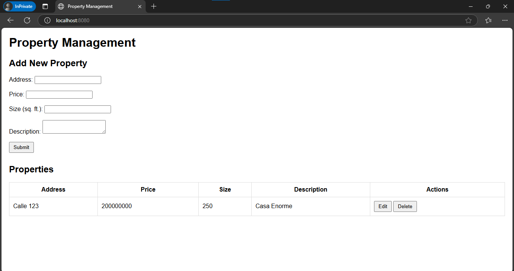
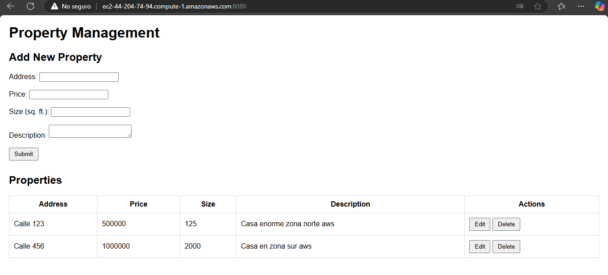
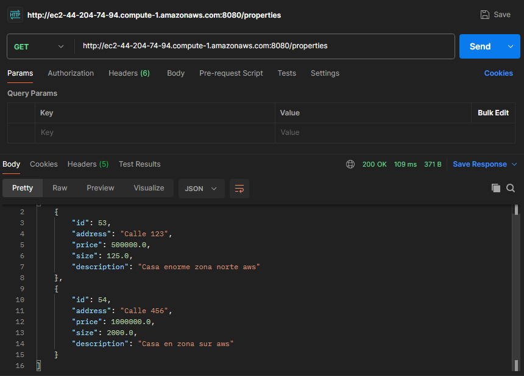
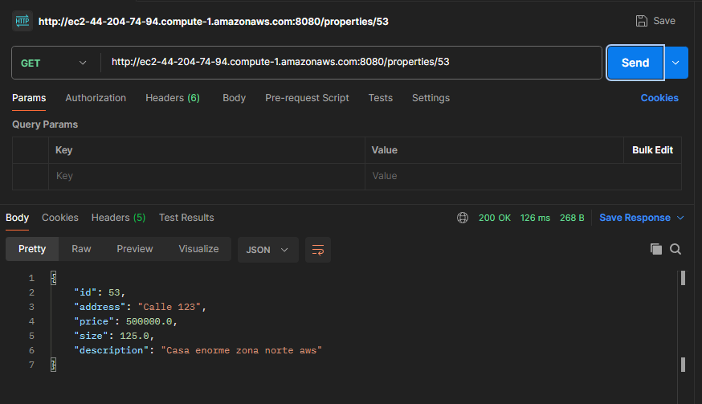
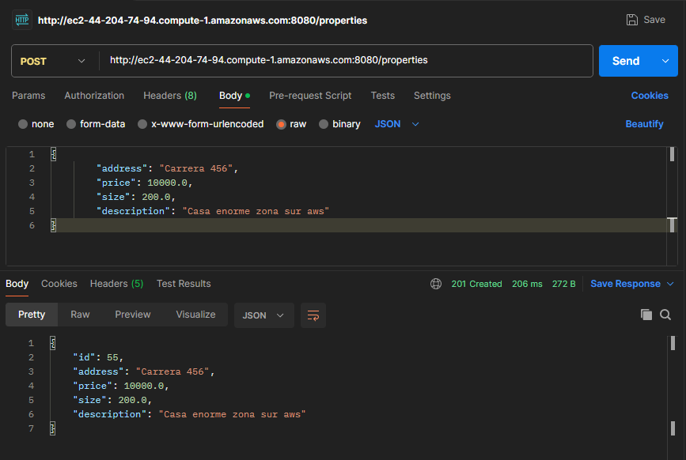
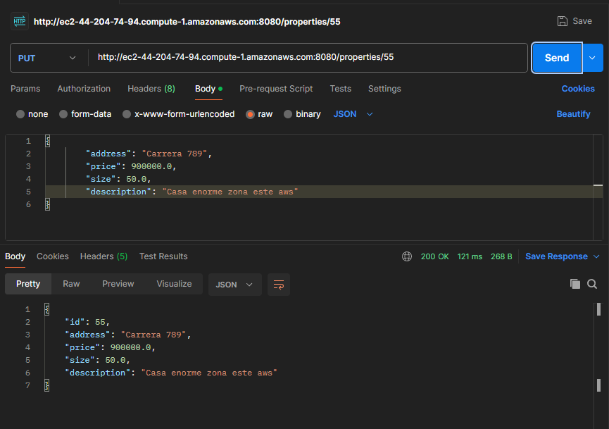
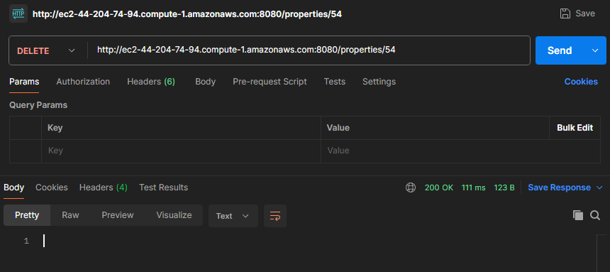

# Taller 5 | AREP

## Creation of a CRUD System to Manage Properties

In this project, we will develop a simple CRUD (Create, Read, Update, Delete) system for managing real estate properties. They will build a basic web application that enables users to perform key operations on property listings, finally the web application will be released in AWS.

## Project Summary

## Architecture

The architecture used aligns with the Client-Server pattern, in which a server hosts all resources, and one or more clients can access and use these resources through requests that are responded to by the Backend's REST services.


## Class Design

```
src/
  main/
    java/
      co/
        edu/
          eci/
            controller/
              PropertyController.java
            model/
              Property.java
            repository/
              PropertyRepository.java
            service/
              PropertyService.java
            WebApplication.java                 # Clase principal
    resources/
        images/                                 # Recursos para el archivo Readme
        static/            
            index.html
            styles.css
            script.js
        application.properties
  test/
    java/
      co/
        edu/
          eci/
            WebApplicationTest.java             # Pruebas Unitarias
Dockerfile
pom.xml
README.md
```

## Getting Started

These instructions will allow you to get a working copy of the project on your local machine for development and testing purposes.

### Prerequisites

- [Java](https://www.oracle.com/co/java/technologies/downloads/) 21 or higher.
- [Maven](https://maven.apache.org/download.cgi). 3.8.1 o higher.
- [Docker](https://www.docker.com/products/docker-desktop/). Latest
- [AWS](https://aws.amazon.com/). Account
- [Git](https://git-scm.com/downloads) (optional).
- Web Browser.

To check if installed, run:

```
java -version
```
```
mvn --version
```
```
docker --version
```
```
git --version
```

### Installing and Deployment

1. Download the repository from GitHub in a .zip or clone it to your local machine using Git.

    ```
    git clone https://github.com/jcontreras2693/AREP-Lab5.git
    ```
   
2. Navigate to the project directory.

    ```
    cd AREP-Lab5
    ```
   
3. Build the project by running the following command:

    ```
    mvn clean compile
    ```

   

4. Run MySQL on Docker with the next command:

    ```
    docker run --name mysql-container -e MYSQL_ROOT_PASSWORD=root -e MYSQL_DATABASE=properties_db -p 3306:3306 -d mysql
    ```

5. Run the application with this command:

   ```
   mvn spring-boot:run
   ```

6. For local test access the address [localhost:8080](http://localhost:8080/) from a web browser to interact with the web application.

   

7. Create the Docker image of the application:

    ```
    docker build --tag taller5arep .
    ```

7. Login and create the image on Dockerhub, the push the image:

    ```
    docker login
    docker tag taller5arep tu-usuario-docker/tu-repositorio-dockerhub
    docker push tu-usuario-docker/tu-repositorio-dockerhub
    ```

8. Run the application with this command:

   ```
   mvn spring-boot:run
   ```

9. Finally, access the address [localhost:8080](http://localhost:8080/) from a web browser to interact with the web application.

    

10. AWS deployed.


## Application Running

- Homepage

  

- Dockerhub

  

- GET Request example.

  

- GET Request example by ID.

  

- POST Request example.

  

- PUT Request example.

  

- DELETE Request example.

  

## Running the Tests

The tests performed verify the getters and setters of the Pokémon class, the PokemonController GET and POST actions and the Concurrency on PokemonServer.

To run the tests from the console, use the following command:

```
mvn test
```

If the tests were successful, you will see a message like this in your command console.


## Built With

* [Java Development Kit](https://www.oracle.com/co/java/technologies/downloads/) - Software Toolkit
* [Maven](https://maven.apache.org/) - Dependency Management
* [Git](https://git-scm.com/) - Distributed Version Control System

## Authors

* **Juan David Contreras Becerra** - *Taller 5 | AREP* - [AREP-Lab5](https://github.com/jcontreras2693/AREP-Lab5.git)

## Acknowledgements

* **Billie Thompson** - *README template* - [PurpleBooth](https://github.com/PurpleBooth)
