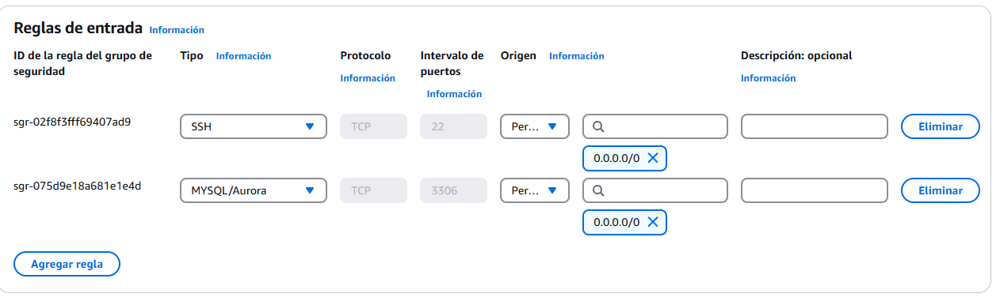
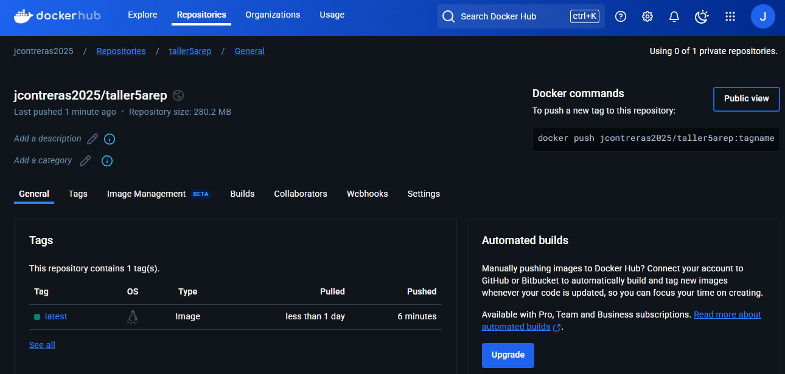
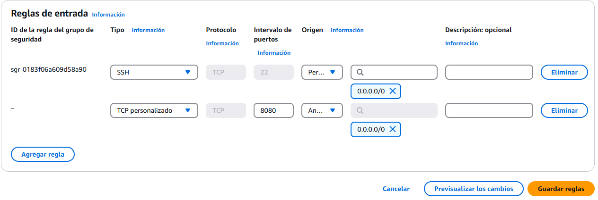

# Taller 5 | AREP

## Creation of a CRUD System to Manage Properties

In this project, we will develop a simple CRUD (Create, Read, Update, Delete) system for managing real estate properties. They will build a basic web application that enables users to perform key operations on property listings, finally the web application will be released in AWS.

## Project Summary

## Architecture

The architecture used aligns with the Client-Server pattern, in which a server hosts all resources, and one or more clients can access and use these resources through requests that are responded to by the Backend's REST services.


## Class Design

```
src/
  main/
    java/
      co/
        edu/
          eci/
            controller/
              PropertyController.java
            model/
              Property.java
            repository/
              PropertyRepository.java
            service/
              PropertyService.java
            WebApplication.java                 # Clase principal
    resources/
        images/                                 # Recursos para el archivo Readme
        static/            
            index.html
            styles.css
            script.js
        application.properties
  test/
    java/
      co/
        edu/
          eci/
            WebApplicationTest.java             # Pruebas Unitarias
Dockerfile
pom.xml
README.md
```

## Getting Started

These instructions will allow you to get a working copy of the project on your local machine for development and testing purposes.

### Prerequisites

- [Java](https://www.oracle.com/co/java/technologies/downloads/) 21 or higher.
- [Maven](https://maven.apache.org/download.cgi). 3.8.1 o higher.
- [Docker](https://www.docker.com/products/docker-desktop/). Latest
- [AWS](https://aws.amazon.com/). Account
- [Git](https://git-scm.com/downloads) (optional).
- Web Browser.

To check if installed, run:

```
java -version
```
```
mvn --version
```
```
docker --version
```
```
git --version
```

### Installing

1. Download the repository from GitHub in a .zip or clone it to your local machine using Git.

    ```
    git clone https://github.com/jcontreras2693/AREP-Lab5.git
    ```
   
2. Navigate to the project directory.

    ```
    cd AREP-Lab5
    ```
   
3. Build the project by running the following command:

    ```
    mvn clean install
    ```

   

## Deployment

1. Create a default EC2 instance on AWS and add a new Security Rule on the Security Group of the instance.

   

2. Connect to the EC2 instance, install docker with these commands:

    ```
    sudo yum update -y
    sudo yum install docker
    ```

3. Create and un a mysql image on Docker, this will be our Database:

    ```
    docker run --name mysql-container -e MYSQL_ROOT_PASSWORD=root -e MYSQL_DATABASE=properties_db -p 3306:3306 -d mysql
    ```
4. Enable external connections to the DB, first get into the container (password: root) with the command:

    ```
    docker exec -it mysql-container mysql -u root -p
    ```

5. Use these commands on the MySQL console:

    ```
    CREATE USER 'springuser'@'%' IDENTIFIED BY 'password';
    GRANT ALL PRIVILEGES ON properties_db.* TO 'springuser'@'%' WITH GRANT OPTION;
    FLUSH PRIVILEGES;
    ```
   
6. Exit the connection and replace this line in the application.properties file:

    ```
    spring.datasource.url=jdbc:mysql://your-EC2-public-IP:3306/properties_db
    ```

7. Create the Docker image of the application:

    ```
    docker build --tag taller5arep .
    ```

8. For local tests [localhost:8080](http://localhost:8080/), create a Docker container of the application or run it using an IDE:

    ```
    docker run -d -p 8080:8080 --name taller5container taller5arep
    ```

   

9. Login and create the image on Dockerhub, the push the image:

    ```
    docker login
    docker push jcontreras2025/taller5arep
    ```

    

10. Create a new default EC2 instance on AWS and add a new Security Rule on the Security Group of the instance.:

   

11. Connect to the EC2 instance, install docker with these commands:

    ```
    sudo yum update -y
    sudo yum install docker
    ```

12. Start the Docker service and run the container with the application using this command:

   ```
   sudo service docker start
   sudo docker run -d -p 42000:8080 --name taller5 jcontreras2025/taller5arep
   ```

10. Copy the public DNS of the EC2 instance and paste it on a web browser using the port 42000, should look like this:

    ```
    http://ec2-100-24-43-190.compute-1.amazonaws.com:42000/
    ```

## Application Running

- GET Request example.

  

- GET Request example by ID.

  

- POST Request example.

  

- PUT Request example.

  

- DELETE Request example.

  

## Running the Tests

The tests performed verify the getters and setters of the Pokémon class, the PokemonController GET and POST actions and the Concurrency on PokemonServer.

To run the tests from the console, use the following command:

```
mvn test
```

If the tests were successful, you will see a message like this in your command console.


## Built With

* [Java Development Kit](https://www.oracle.com/co/java/technologies/downloads/) - Software Toolkit
* [Maven](https://maven.apache.org/) - Dependency Management
* [Git](https://git-scm.com/) - Distributed Version Control System

## Authors

* **Juan David Contreras Becerra** - *Taller 5 | AREP* - [AREP-Lab5](https://github.com/jcontreras2693/AREP-Lab5.git)

## Acknowledgements

* **Billie Thompson** - *README template* - [PurpleBooth](https://github.com/PurpleBooth)
